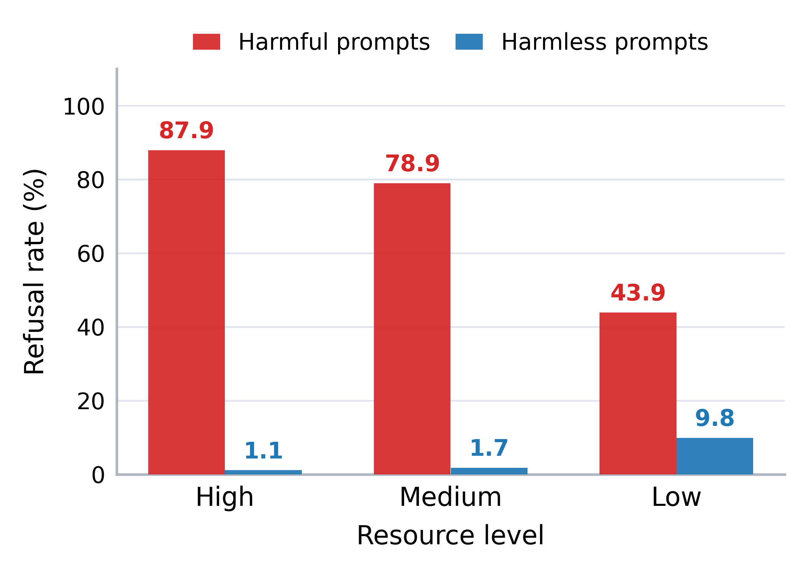
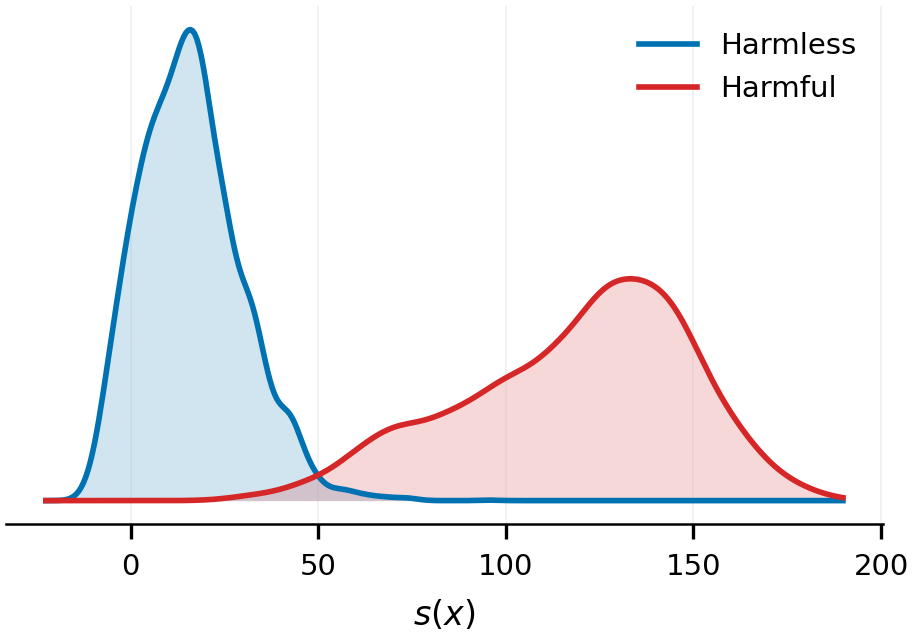
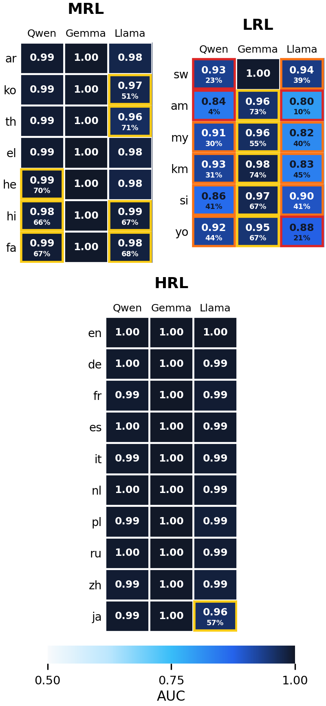
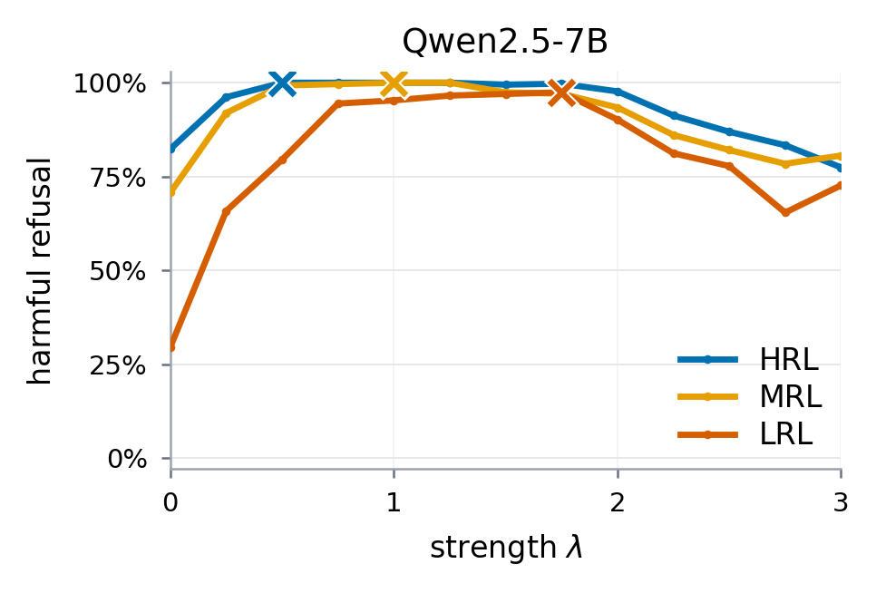
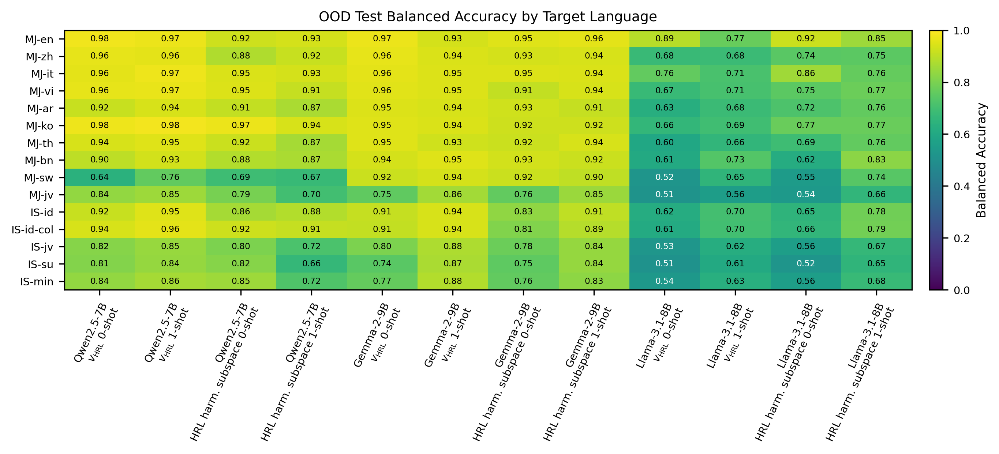

# Official Repository for "Low-Resource Safety Failures Are Action Failures, Not Representation Failures"

[](https://arxiv.org/abs/2606.01196)

## Repository Structure

```text
.
├── assets/
│   └── figures/                  # committed release figures
├── configs/
│   ├── activation_sweep/         # harmfulness-direction activation sweeps
│   ├── hrl_direction/            # activation extraction and HRL direction estimation
│   ├── ood_transfer/             # OOD paired data and transfer experiments
│   ├── recoverability/           # OMNIGuard, U-Score, and probe comparisons
│   ├── refusal_gap/              # completion generation and refusal scoring
│   ├── routing_refusal/          # intervention and utility configs
│   └── {model,dataset,...}/      # shared Hydra config groups
├── scripts/
│   ├── activation_sweep/         # run and score activation sweeps
│   ├── hrl_direction/            # extract activations and compute directions
│   ├── ood_transfer/             # build/evaluate OOD transfer data
│   ├── recoverability/           # recover harmfulness from hidden states
│   ├── refusal_gap/              # generate completions and score refusal
│   ├── routing_refusal/          # run steering and utility baselines
│   └── setup/                    # seed PolyRefuse and translated data
├── src/multilingual_latent_safety/
│   ├── data.py, model.py, generation.py
│   ├── activations.py, activation_store.py
│   ├── probe_evaluation.py, probes.py, vector_ops.py
│   ├── interventions.py, conditional_vhrl.py, adasteer.py, cast.py
│   └── judges/, refusal_scoring.py, omniguard.py
├── pyproject.toml
└── uv.lock
```

The main model configs are `qwen2.5-7b-instruct`, `gemma-2-9b-it`, and `llama-3.1-8b-instruct`. Most experiment configs default to Qwen2.5-7B-Instruct; override with `model=gemma-2-9b-it` or `model=llama-3.1-8b-instruct`.

## Setup

Install dependencies with `uv`:

```bash
uv sync
source .venv/bin/activate
```

Set credentials for gated models and refusal scoring:

```bash
huggingface-cli login
export HF_HUB_ENABLE_HF_TRANSFER=1
export OPENROUTER_API_KEY=...
```

Prepare the local PolyRefuse data directory:

```bash
uv run python scripts/setup/polyrefuse_download.py --dest data/polyrefuse
```

The canonical dataset config is `configs/dataset/polyrefuse.yaml`. It defines the local root, language list, resource tiers, and default RNG seed.

Optional OOD transfer inputs use local files under `data/external/` plus translated harmless prompts under `data/ood_harmless_translations/`. Use the setup helpers for translation workflows:

```bash
uv run python scripts/setup/polyrefuse_translate.py --help
uv run python scripts/setup/translate_ood_harmless_polyrefuse.py --help
uv run python scripts/setup/evaluate_translation_quality.py --help
```

Translation quality follows Wang et al.'s PolyRefuse check: back-translate each
target-language prompt to English, then report BLEU and SBERT similarity against
the original English prompt. The default command evaluates
`data/polyrefuse/harmful_test_translated_*.json` and writes metrics to
`artifacts/translation_quality/polyrefuse/`.

## Reproducibility

Experiment parameters live in Hydra configs under `configs/`. Single-run RNG
seeds use `seed`; repeated-trial configs use `seeds` plus `seed_offset`. Runtime
seeding uses `set_seed(seed)` in `src/multilingual_latent_safety/runtime.py`.


## Reproducing the Experiments

Each command below can be customized with Hydra overrides. For example:

```bash
uv run python scripts/hrl_direction/extract_activations.py model=gemma-2-9b-it
```

### 1. Multilingual Refusal Gap

Generate model completions and score refusal with either the OpenRouter refusal judge or local guard models.

```bash
uv run python scripts/refusal_gap/generate_completions.py
uv run python scripts/refusal_gap/score_refusal.py \
  completions_root=artifacts/completions/Qwen/Qwen2.5-7B-Instruct/gen=greedy \
  model_name=Qwen/Qwen2.5-7B-Instruct
uv run python scripts/refusal_gap/score_guard_refusal.py
```

Configs: `configs/refusal_gap/`, `configs/judge/`, and `configs/guard_judge/`.



### 2. High-Resource Harmfulness Direction

Extract residual activations, estimate per-language harmfulness directions, and pool high-resource language directions.

```bash
uv run python scripts/hrl_direction/extract_activations.py
uv run python scripts/hrl_direction/compute_harmful_direction.py
uv run python scripts/hrl_direction/compute_hrl_pooled_direction.py
uv run python scripts/hrl_direction/compute_hrl_pooled_dim_direction.py
```

Configs: `configs/hrl_direction/` and `configs/extraction/`.



### 3. Recoverability After Refusal Failure

Extract OMNIGuard representations, compute U-Score metrics, evaluate low-resource few-shot gates, and compare probe families.

```bash
uv run python scripts/recoverability/extract_omniguard_representations.py
uv run python scripts/recoverability/compute_omniguard_uscore.py
uv run python scripts/recoverability/compute_lrl_fewshot_recoverability.py
uv run python scripts/recoverability/compute_probe_method_comparison.py
```

Configs: `configs/recoverability/`.



### 4. Activation Strength Sweep

Sweep harmfulness-direction activation strength during generation, then score the resulting completions.

```bash
uv run python scripts/activation_sweep/run_refusal_activation_sweep.py
uv run python scripts/activation_sweep/score_refusal_activation_sweep.py
```

Configs: `configs/activation_sweep/`.



### 5. OOD Transfer

Build paired OOD data, evaluate latent-gate transfer across datasets, and run crosslingual source-language ablations.

```bash
uv run python scripts/ood_transfer/build_ood_paired_dataset.py
uv run python scripts/ood_transfer/compute_ood_latent_gate_transfer.py
uv run python scripts/ood_transfer/compute_crosslingual_subspace_transfer.py
```

Configs: `configs/ood_transfer/`.



### 6. Routing Decodable Harmfulness Into Refusal

Run activation interventions, evaluate Global-MMLU utility, and compare conditional VHRL, directional ablation, AdaSteer, adapted AdaSteer, and CAST-style steering.

```bash
uv run python scripts/routing_refusal/intervene_and_generate.py intervention=conditional_vhrl
uv run python scripts/routing_refusal/evaluate_global_mmlu_utility.py
uv run python scripts/routing_refusal/download_adasteer_vectors.py
uv run python scripts/routing_refusal/compute_adapted_adasteer_vectors.py
uv run python scripts/routing_refusal/run_cast_steering.py
```

Use `intervention=directional_ablation`, `intervention=conditional_vhrl`, `intervention=adasteer`, or `intervention=adasteer_adapted` with `intervene_and_generate.py`.

Configs: `configs/routing_refusal/` and `configs/intervention/`.
